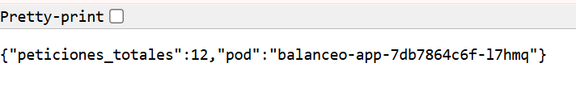
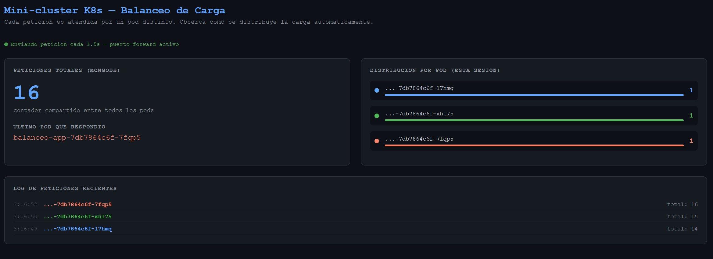
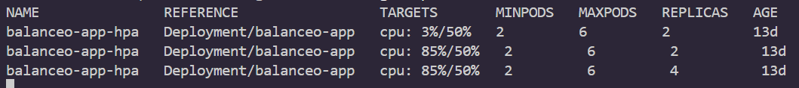

# Guía de ejecución

← [TEORIA.md](TEORIA.md) · [Índice](README.md)

Para entender los conceptos detrás de este proyecto, lee [TEORIA.md](TEORIA.md) primero.

---

## Requisitos

Instala estas herramientas antes de continuar:

| Herramienta | Para qué sirve | Descarga |
|---|---|---|
| **Docker Desktop** | Motor de contenedores (incluye kubectl) | [docker.com/products/docker-desktop](https://www.docker.com/products/docker-desktop) |
| **minikube** | Clúster Kubernetes local | [minikube.sigs.k8s.io](https://minikube.sigs.k8s.io/docs/start/) |
| **Git** | Clonar el repositorio | [git-scm.com](https://git-scm.com) |

> Asegúrate de que Docker Desktop esté corriendo (ícono visible en la barra de tareas) antes de continuar.

---

## Despliegue

### 1. Clonar el repositorio

```powershell
git clone https://github.com/amesitos/balanceo-carga-k8
cd balanceo-carga-k8
```

### 2. Arrancar minikube y activar el metrics-server

```powershell
minikube start
minikube addons enable metrics-server
```

> `minikube start` puede tardar 1–3 minutos la primera vez. El metrics-server es necesario para que el HPA pueda medir el CPU de los pods y decidir cuándo escalar.

Verifica que el nodo está listo:

```powershell
kubectl get nodes
# NAME       STATUS   ROLES           AGE
# minikube   Ready    control-plane   1m
```

### 3. Desplegar MongoDB

```powershell
kubectl apply -f mongo-deployment.yaml
```

Espera a que el pod esté `Running` antes de continuar:

```powershell
kubectl get pods
# NAME             READY   STATUS
# mongo-xxxxx      1/1     Running   ← tiene que decir Running
```

### 4. Desplegar la app y el autoscaler

```powershell
kubectl apply -f app-deployment.yaml
kubectl apply -f hpa.yaml
```

Verifica que todo esté corriendo:

```powershell
kubectl get pods
# NAME                       READY   STATUS
# balanceo-app-xxxxx-aaa     1/1     Running
# balanceo-app-xxxxx-bbb     1/1     Running
# mongo-xxxxx                1/1     Running
```

Verifica el estado del HPA (espera a que `TARGETS` deje de mostrar `<unknown>`):

```powershell
kubectl get hpa
# NAME               TARGETS   MINPODS   MAXPODS   REPLICAS
# balanceo-app-hpa   2%/50%    2         6         2
```

### 5. Abrir la app en el navegador

```powershell
minikube service balanceo-app-svc
```

Esto abre el navegador automáticamente y muestra una URL del estilo `http://127.0.0.1:XXXXX`. **Anota ese puerto** — lo necesitarás en los siguientes pasos.

---

## Demos

Reemplaza `XXXXX` con el puerto que devolvió `minikube service` en el paso anterior.

### Demo 1 — Balanceo de carga visible

Haz 10 peticiones seguidas y observa que distintos pods responden:

```powershell
for ($i=1; $i -le 10; $i++) { (Invoke-RestMethod http://127.0.0.1:XXXXX/).pod }
```

Resultado esperado — el nombre del pod cambia entre peticiones:

```
balanceo-app-5c5958b74-2dhqd
balanceo-app-5c5958b74-wdqbs
balanceo-app-5c5958b74-2dhqd
balanceo-app-5c5958b74-wdqbs
```



O abre el dashboard en el navegador para verlo en tiempo real:

```
http://127.0.0.1:XXXXX/dashboard
```



---

### Demo 2 — Estado compartido entre pods

Aunque distintos pods atienden cada petición, el contador global sigue subiendo de forma consistente porque todos escriben en la misma MongoDB:

```powershell
Invoke-RestMethod http://127.0.0.1:XXXXX/
# pod: balanceo-app-xxx-aaa   peticiones_totales: 7

Invoke-RestMethod http://127.0.0.1:XXXXX/
# pod: balanceo-app-xxx-bbb   peticiones_totales: 8  ← pod distinto, contador sigue
```

---

### Demo 3 — Auto-reparación

```powershell
# Ver los pods actuales
kubectl get pods

# Borrar uno (copia el nombre completo de la columna NAME)
kubectl delete pod balanceo-app-NOMBRE-COMPLETO

# En otra terminal, observar cómo K8s lo recrea solo
kubectl get pods -w
```

Se verá el pod pasar a `Terminating` y enseguida aparecer uno nuevo en `ContainerCreating` → `Running`. Kubernetes detectó que el número de réplicas bajó y creó uno nuevo automáticamente.

---

### Demo 4 — Autoescalado con HPA

**Terminal 1** — lanzar carga de CPU:

```powershell
while ($true) { Invoke-RestMethod http://127.0.0.1:XXXXX/stress | Out-Null }
```

**Terminal 2** — observar cómo escala:

```powershell
kubectl get hpa -w
```

Resultado esperado — el CPU sube y Kubernetes crea más pods automáticamente:

```
NAME               TARGETS    MINPODS   MAXPODS   REPLICAS
balanceo-app-hpa   2%/50%     2         6         2
balanceo-app-hpa   67%/50%    2         6         3
balanceo-app-hpa   89%/50%    2         6         4
balanceo-app-hpa   94%/50%    2         6         6
```



Al detener el stress (Ctrl+C en Terminal 1), en ~5 minutos el HPA reduce los pods de vuelta a 2.

---

## Limpieza

```powershell
kubectl delete -f hpa.yaml
kubectl delete -f app-deployment.yaml
kubectl delete -f mongo-deployment.yaml
minikube stop
```

---

## Referencia de comandos útiles

```powershell
kubectl get pods              # estado de los pods
kubectl get hpa               # estado del autoscaler
kubectl get services          # servicios y puertos
kubectl logs <nombre-pod>     # logs de un pod
kubectl describe pod <nombre> # información detallada de un pod
kubectl delete pod <nombre>   # borrar un pod (K8s lo recrea solo)
minikube service <nombre-svc> # abrir un servicio en el navegador
minikube stop                 # detener el clúster local
```

---

→ Siguiente: [ACTIVIDAD.md](ACTIVIDAD.md)
